### **声明式导航**

##### 

> **tabBar**

> > **<u>*open-type*="switchTab"</u>**

> **非tabBar可以省略**

> > ***open-type*="navigate"**

###  后退

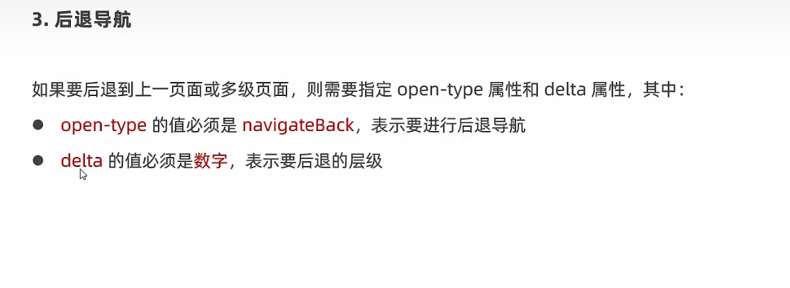

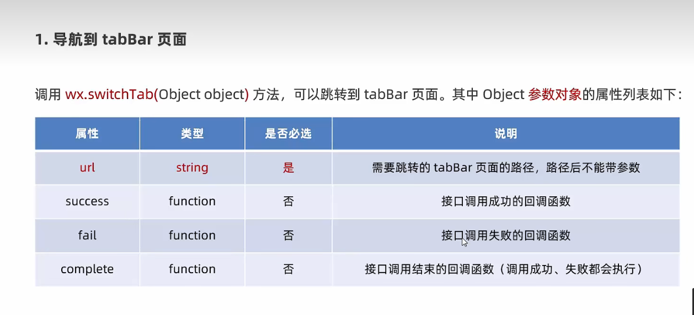

**地址后可携带参数**

> **获取传递的参数**

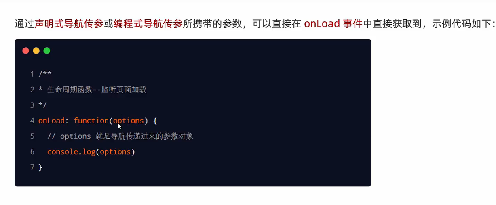

传递的参数options一般定义到data

**data(**

**query:{}**

**)**

**this.setData({**

**query：options**

**})**

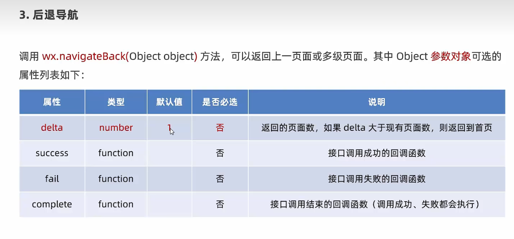

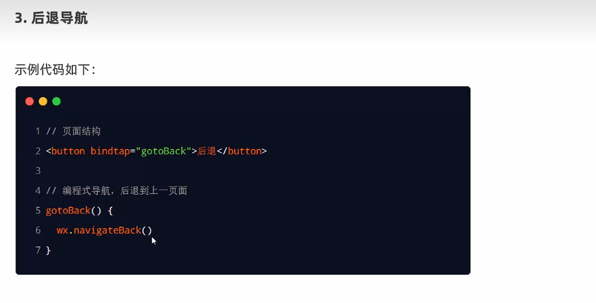

 

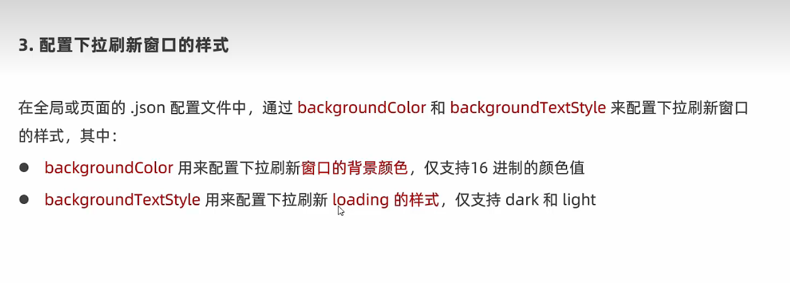

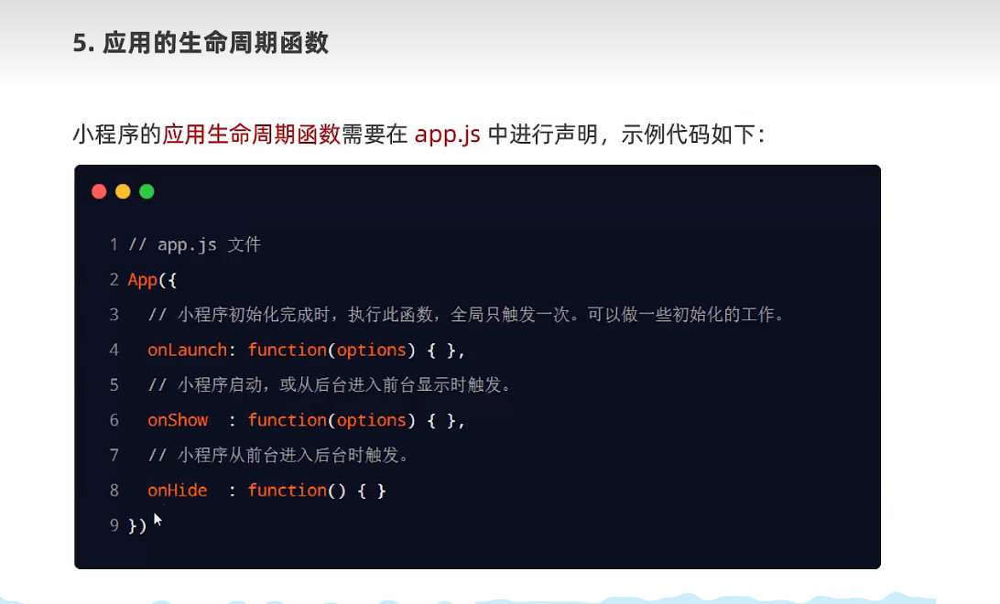

### **通用样式wxss文件放在common文件夹里面和pages平级用import引入**

****

1. **组件文件夹和pages文件夹平级一个组件一个文化夹**
2. **wxs脚本编写在utils文件夹下面**
3. 

**传递参数的获取**

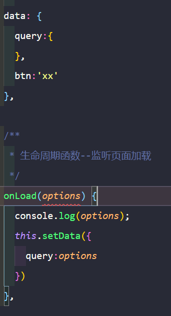

1. target在事件流的目标阶段；currentTarget在事件流的捕获，目标及冒泡阶段。只有当事件流处在目标阶段的时候，    两个的指向才是一样的，
2. 而当处于捕获和冒泡阶段的时候，target指向被单击的对象而currentTarget指向当前事件活动的对象（一般为父级）。

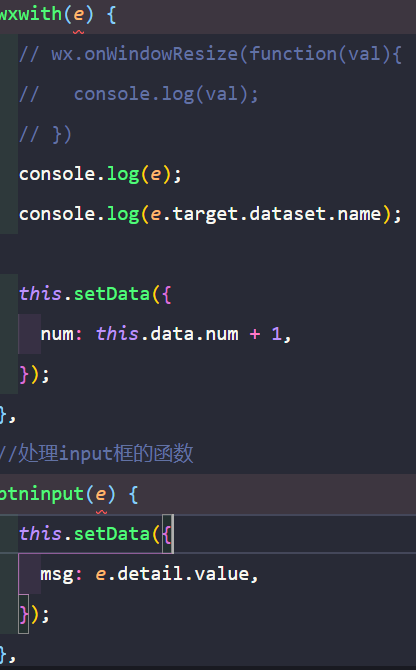

### **组件**

> 组件引入
>
> 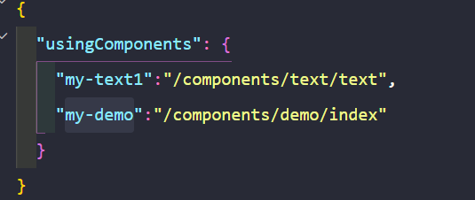

**组件的样式由自己控制只有class才有样式隔离效果**

### **实现控制样式**

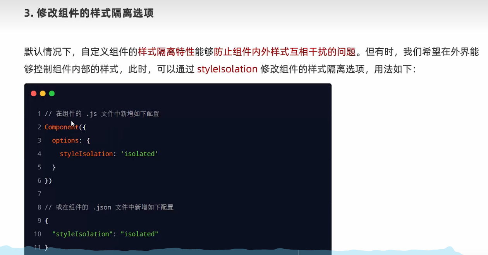

### **组件接受数据**

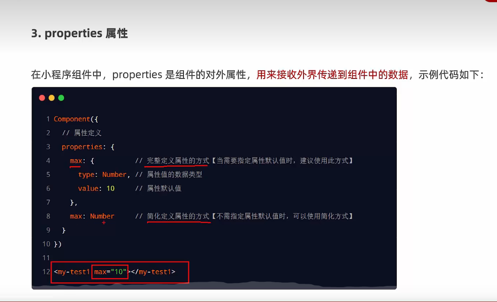

### **组件的事件监听**

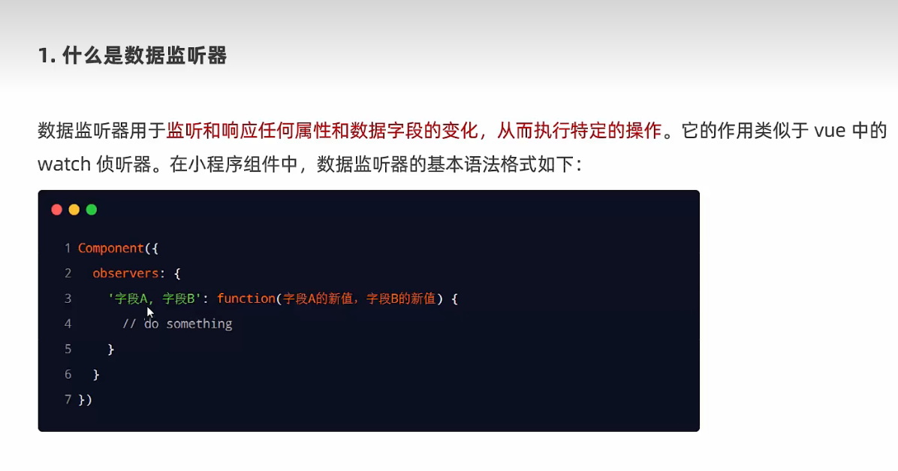

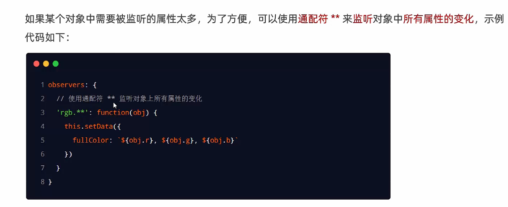

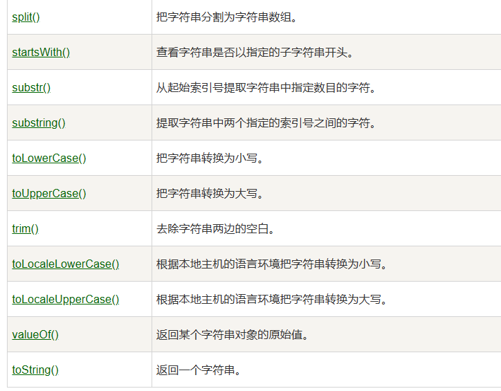

### **组件的纯数字手段**

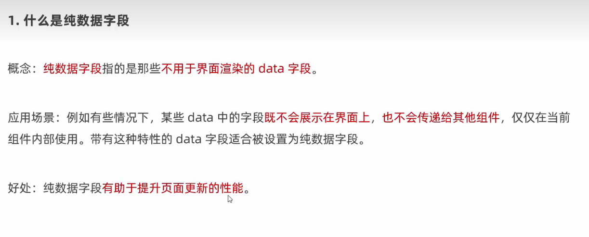

### **组件的生命周期顺序**

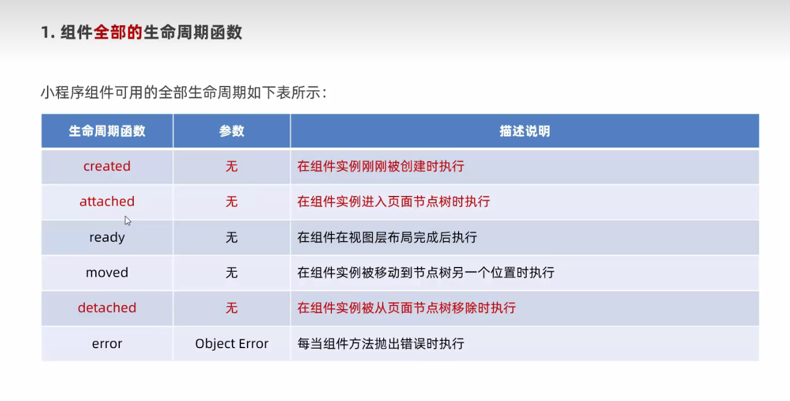

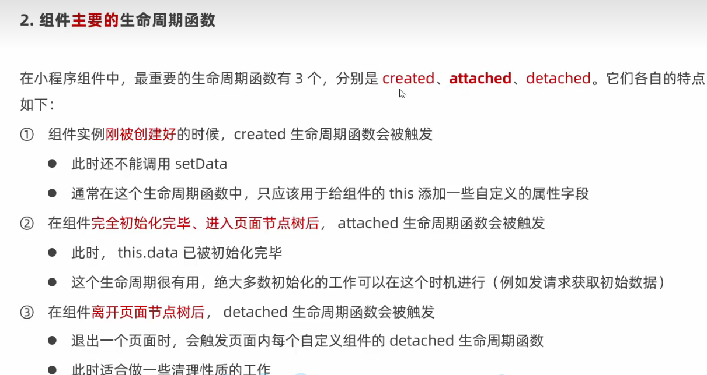

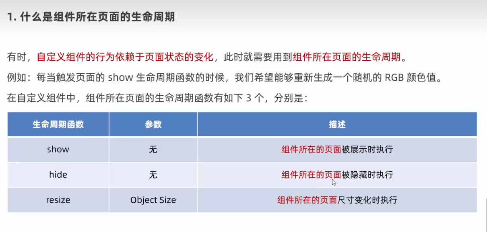

按钮的绑定时间有很多

### bind ...tap

阻止事件绑定冒泡catchtap

### 微信小程序常用的api

(https://blog.csdn.net/qq_59012240/article/details/127856826)

### wx.setNavigationBarTitle() 标题栏文本

###  wx.setNavigationBarColor() 页面导航条颜色

### wx.showLoading() 加载提示 和 wx.hideLoading() 停止提示

### wx.showToast() 提示

###  wx.showModal() 模态框对话框

###  wx.getUserProfile() 获取用户信息

###  wx.getUserProfile(desc:'') 获取用户信息

### wx.downloadFile()下载文件

### wx.saveImageToPhotosAlbum()保存图片到相册

### wx.uploadFile()上传文件

### 定义css变量需要定义在app.wxss

使用var来使用

### 实现api promise化

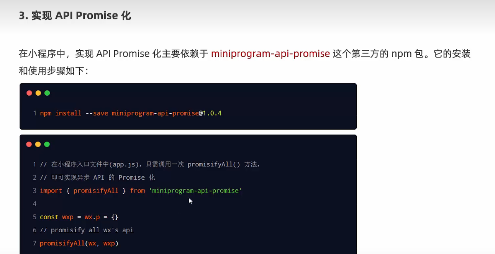

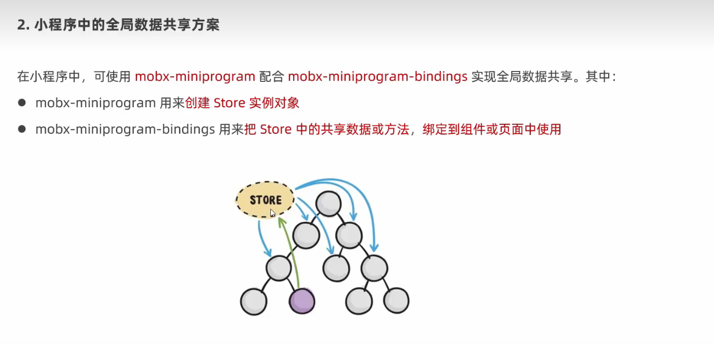

cnpm i --save mobx-miniprogram@4.13.2 mobx-miniprogram-bindings@1.2.1

### 分包配置

    
    

